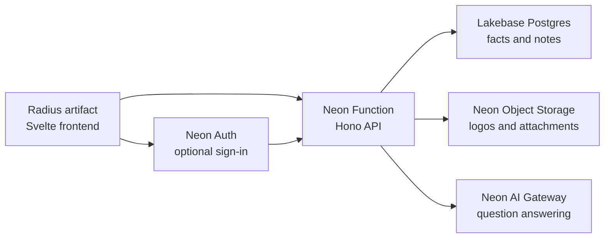

# Radius artifact with a Neon backend

A public, interactive example showing that a multi-file [Radius artifact](https://radius.pi.dev/) can use [Neon](https://neon.com/) as a complete backend.

The Radius artifact serves a Svelte frontend called **web dev fun facts**. Visitors can browse 53 facts and ask an agent questions without signing in. Neon Auth adds an optional private workspace where people can create notes, attach files, and chat with their own notes.

**Live demo:** https://01m2bj2gvpf0t88sf41r93gf76.trove.sh/

## Architecture



| Capability | Purpose |
| --- | --- |
| Radius artifact | Hosts the compiled HTML, CSS, and JavaScript |
| Lakebase Postgres | Stores public facts and private notes |
| Neon Object Storage | Stores fact logos and user attachments |
| Neon Function | Provides the API and keeps credentials server-side |
| Neon Auth | Identifies users of the optional private workspace |
| Neon AI Gateway | Answers questions using note text as context |

The frontend contains only public service URLs. Database, storage, and AI credentials stay inside the Neon Function.

## Stack

- Svelte 5 and Vite
- Hono
- Drizzle ORM and `pg`
- Neon Functions, Auth, Object Storage, AI Gateway, and Lakebase Postgres
- Vercel AI SDK with the Neon provider
- Simple Icons for seeded logo attachments

## Requirements

- Node.js 20.19 or newer
- pnpm 10
- A Neon account and current `neon` CLI
- A Neon project in `aws-us-east-2` or `aws-eu-central-1`
- A paid Neon plan for AI Gateway access
- Radius access for publishing the frontend artifact

Neon Functions, Object Storage, and AI Gateway are beta services. Check the current [Neon backend beta guide](https://neon.com/docs/get-started/backend-beta) before using this example for production work.

## Project structure

```text
functions/api.ts             Hono API deployed as a Neon Function
src/                         Svelte frontend and shared database schema
seed/facts.ts                53 sourced web development facts
scripts/seed.ts              Postgres and Object Storage seed script
scripts/configure-storage-cors.ts
                             Browser upload CORS setup
scripts/write-runtime-config.ts
                             Creates public dist/config.json
neon.ts                      Branch-aware Neon backend definition
drizzle/                     SQL migrations
public/config.json           Local frontend runtime defaults
```

## Set up Neon

Install dependencies and sign in:

```bash
pnpm install
neon login
```

Link a project in a supported region. You can select an existing project or create one:

```bash
neon link
neon checkout dev --create --no-env-pull
```

Create a gitignored `.env.local` from `.env.example`. Add a strong Auth cookie secret:

```bash
cp .env.example .env.local
openssl rand -base64 48
```

Paste the generated value into `.env.local`:

```dotenv
NEON_AUTH_COOKIE_SECRET=replace-me
```

Review and apply the branch configuration:

```bash
neon config plan --env .env.local
neon deploy --env .env.local --update-existing
```

Deployment provisions Neon Auth, the private `attachments` bucket, the `webdevfacts` Function, and AI Gateway access. It also pulls Neon-managed values into `.env.local`.

Run the migration, seed Postgres and Object Storage, then configure storage CORS:

```bash
pnpm db:migrate
pnpm db:seed
pnpm storage:cors
```

The seed script is safe to run again. It updates facts by slug and replaces their logo objects.

## Configure the frontend

Set these public values in `.env.local` after deployment:

```dotenv
PUBLIC_API_URL=https://your-function-url
PUBLIC_NEON_AUTH_URL=https://your-neon-auth-url
```

Use the values pulled as `NEON_FUNCTION_WEBDEVFACTS_BASE_URL` and `NEON_AUTH_BASE_URL`. They are public endpoints, not credentials.

For local authentication, allow localhost:

```bash
neon neon-auth domain allow-localhost enable
```

Run the Vite frontend and Neon Function locally in separate terminals:

```bash
pnpm dev
pnpm neon:dev
```

You can also use the deployed Function while developing the frontend by setting `PUBLIC_API_URL` to its deployed URL.

## Build the Radius artifact

```bash
pnpm check
pnpm test
pnpm build
```

The multi-file artifact is produced in `dist/`. Publish the contents of that directory as one Radius artifact. Keep publishing revisions to the same artifact so its canonical URL remains stable.

After the first publish:

1. Add the artifact's origin to `APP_ORIGINS` in `.env.local`.
2. Run `neon deploy --env .env.local --update-existing`.
3. Run `pnpm storage:cors`.
4. Add the artifact URL to Neon Auth's trusted domains:

```bash
neon neon-auth domain add https://your-radius-artifact-origin
```

5. Rebuild and publish a new revision if either public endpoint changed.

## Public and private behavior

### Public workspace

- No account required
- Facts are read-only
- Logos use one-hour signed download URLs
- AI answers only from the seeded fact text

### Private workspace

- Email and password sign-in through Neon Auth
- Every API request carries a short-lived Neon Auth JWT
- The Function verifies the JWT and scopes queries by `user_id`
- Each note supports up to three PNG, JPEG, PDF, Markdown, or text attachments
- Each attachment is limited to 5 MB
- The AI reads note titles and text, not attachment contents

The artifact and Neon Auth are on different origins. Browsers that strictly block third-party cookies, especially Safari, may not preserve the optional sign-in session. The public demo does not use cookies and still works. A production deployment should use a shared parent domain or an auth reverse proxy. See Neon's [JWT guidance](https://neon.com/docs/auth/guides/plugins/jwt#retrieve-a-token).

This is a temporary demonstration. Do not store sensitive information in it.

## API

| Method | Path | Access | Purpose |
| --- | --- | --- | --- |
| `GET` | `/health` | Public | Backend health |
| `GET` | `/api/facts` | Public | Facts and signed logo URLs |
| `POST` | `/api/chat/public` | Public | Ask about seeded facts |
| `GET/POST` | `/api/me/notes` | Authenticated | List or create notes |
| `PUT/DELETE` | `/api/me/notes/:id` | Authenticated | Update or delete a note |
| `POST` | `/api/me/notes/:id/attachments/presign` | Authenticated | Create an upload URL |
| `POST` | `/api/me/notes/:id/attachments/complete` | Authenticated | Record a completed upload |
| `GET` | `/api/me/attachments/:id/url` | Authenticated | Create a download URL |
| `DELETE` | `/api/me/attachments/:id` | Authenticated | Remove an attachment |
| `POST` | `/api/me/chat` | Authenticated | Ask about private notes |

## Useful commands

```bash
pnpm check          # Type-check Svelte, scripts, and Function code
pnpm test           # Check seed catalog invariants
pnpm build          # Build dist/ and write runtime config
pnpm db:migrate     # Apply SQL migrations
pnpm db:seed        # Seed facts and logo attachments
pnpm storage:cors   # Apply bucket CORS from APP_ORIGINS
pnpm neon:deploy    # Deploy neon.ts using .env.local
```

## Design

The interface is inspired by the visual language of [pi.dev](https://pi.dev/): serif copy, monospace controls, thin borders, technical grid paper, square panels, bracket buttons, and dark and light themes. It does not copy the Pi site code or proprietary font files.

## License

MIT. Simple Icons assets are covered separately in [THIRD_PARTY_NOTICES.md](./THIRD_PARTY_NOTICES.md).
