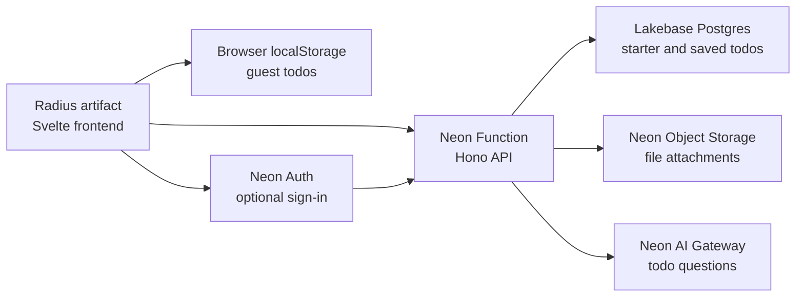

# Radius artifact with a Neon backend

A small example showing that a multi-file [Radius artifact](https://radius.earendil.com/) can use [Neon](https://neon.com/) as a complete backend.

The public app is a funny todo list. Visitors can add, edit, complete, and delete todos without an account because changes are stored in `localStorage`. Neon Auth is required only when someone saves a list online or uploads a file.

**Live demo:** https://01m2bj2gvpf0t88sf41r93gf76.trove.sh/

## Architecture



| Capability | Purpose |
| --- | --- |
| Radius artifact | Hosts the compiled HTML, CSS, and JavaScript |
| Browser `localStorage` | Saves guest changes on one device |
| Lakebase Postgres | Stores the starter list and account lists |
| Neon Object Storage | Stores the example file and account attachments |
| Neon Function | Provides the API and keeps credentials server-side |
| Neon Auth | Protects online saving and uploads |
| Neon AI Gateway | Answers questions about the current list |

The frontend contains only public service URLs. Database, storage, and AI credentials stay inside the Neon Function.

## Stack

- Svelte 5 and Vite
- Hono
- Drizzle ORM and `pg`
- Neon Functions, Auth, Object Storage, AI Gateway, and Lakebase Postgres
- Vercel AI SDK with the Neon provider

## Requirements

- Node.js 20.19 or newer
- pnpm 10
- A Neon account and current `neon` CLI
- A Neon project in `aws-us-east-2` or `aws-eu-central-1`
- A paid Neon plan for AI Gateway access
- Radius access for publishing the frontend artifact

Neon Functions, Object Storage, and AI Gateway are beta services. Check the current [Neon backend beta guide](https://neon.com/docs/get-started/backend-beta) before using this example for production work.

## Project structure

```text
functions/api.ts             Hono API deployed as a Neon Function
src/                         Svelte frontend and database schema
seed/todos.ts                Four funny starter todos and example file
scripts/seed.ts              Postgres and Object Storage seed script
scripts/configure-storage-cors.ts
                             Browser upload CORS setup
scripts/write-runtime-config.ts
                             Creates public dist/config.json
neon.ts                      Branch-aware Neon backend definition
drizzle/                     SQL migration
public/config.json           Local frontend runtime defaults
```

## Set up Neon

Install dependencies and sign in:

```bash
pnpm install
neon login
```

Link a project in a supported region, then create an isolated branch:

```bash
neon link
neon checkout dev --create --no-env-pull
```

Create a gitignored `.env.local` and add a strong Auth cookie secret:

```bash
cp .env.example .env.local
openssl rand -base64 48
```

Paste the generated value into `.env.local`:

```dotenv
NEON_AUTH_COOKIE_SECRET=replace-me
```

Review and apply the backend:

```bash
neon config plan --env .env.local
neon deploy --env .env.local --update-existing
pnpm db:migrate
pnpm db:seed
pnpm storage:cors
```

Deployment provisions Neon Auth, the private `attachments` bucket, the API Function, and AI Gateway access. It also pulls Neon-managed values into `.env.local`.

## Configure the frontend

Set these public values in `.env.local` after deployment:

```dotenv
PUBLIC_API_URL=https://your-function-url
PUBLIC_NEON_AUTH_URL=https://your-neon-auth-url
```

Use the Function URL reported by `neon deploy` and the value pulled as `NEON_AUTH_BASE_URL`. They are public endpoints, not credentials.

For local authentication, allow localhost:

```bash
neon neon-auth domain allow-localhost enable
```

Run the frontend and Function in separate terminals:

```bash
pnpm dev
neon dev --source ./functions/api.ts --port 8787
```

Open http://localhost:5173.

## How the app behaves

### Without an account

- Four starter todos load from Lakebase Postgres.
- The first starter todo has a Markdown attachment in Object Storage.
- Changes are stored under `radius-neon-todos:v1` in the browser.
- Creating, editing, completing, deleting, and resetting todos require no account.
- The current list is sent to the Function only when the visitor asks an AI question.

### With an account

- Selecting **save online** or **attach file** opens Neon Auth if needed.
- Saved lists are scoped to the verified Neon Auth user ID.
- Users can load an online list on another device.
- Each saved todo supports up to three PNG, JPEG, PDF, Markdown, or text attachments.
- Each attachment is limited to 5 MB.

The artifact and Neon Auth are on different origins. Browsers that strictly block third-party cookies, especially Safari, may not preserve the optional sign-in session. The public todo experience does not use cookies and still works.

## API

| Method | Path | Access | Purpose |
| --- | --- | --- | --- |
| `GET` | `/health` | Public | Backend health |
| `GET` | `/api/starter-todos` | Public | Starter todos and example attachment |
| `POST` | `/api/chat` | Public | Ask about the supplied todo list |
| `GET` | `/api/me/todos` | Authenticated | Load an online list |
| `PUT` | `/api/me/todos` | Authenticated | Save an online list |
| `POST` | `/api/me/todos/:id/attachments/presign` | Authenticated | Create an upload URL |
| `POST` | `/api/me/todos/:id/attachments/complete` | Authenticated | Record a completed upload |
| `GET` | `/api/me/attachments/:id/url` | Authenticated | Create a download URL |
| `DELETE` | `/api/me/attachments/:id` | Authenticated | Remove an attachment |

## Build the Radius artifact

```bash
pnpm check
pnpm test
pnpm build
```

Publish the contents of `dist/` as one Radius artifact. Keep publishing revisions to the same artifact so its URL and browser `localStorage` remain stable.

After the first publish:

1. Add the artifact origin to `APP_ORIGINS` in `.env.local`.
2. Run `neon deploy --env .env.local --update-existing`.
3. Run `pnpm storage:cors`.
4. Add the artifact URL to Neon Auth trusted domains.

```bash
neon neon-auth domain add https://your-radius-artifact-origin
```

## Useful commands

```bash
pnpm check          # Type-check Svelte, scripts, and Function code
pnpm test           # Run unit tests
pnpm build          # Build dist/ and write runtime config
pnpm db:migrate     # Apply SQL migrations
pnpm db:seed        # Seed four todos and one attachment
pnpm storage:cors   # Apply bucket CORS from APP_ORIGINS
pnpm neon:deploy    # Deploy neon.ts using .env.local
```

## Design

The interface is inspired by [pi.dev](https://pi.dev/): serif copy, monospace controls, thin borders, technical grid paper, square panels, bracket buttons, and dark and light themes. It does not copy the Pi site code or proprietary font files.

## License

MIT.
